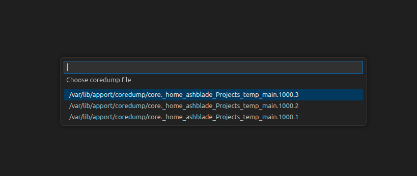

# Pick coredump

Small VS Code extension adding simple command to pick coredump file.
Instead of manually writing full path to it, you just specify input command and choose target coredump file.

## Example

Sample configuration example.

```json
// launch.json
{
    "version": "0.2.0",
    "configurations": [
        {
            "name": "CoreDump",
            "type": "cppdbg",
            "request": "launch",
            "program": "${workspaceRoot}/a.out",
            "cwd": ".",
            "coreDumpPath": "${input:coredumpfile}",
        }
    ],
    "inputs": [
        {
            "id": "coredumpfile",
            "type": "command",
            "command": "pick-coredump.search-coredump",
        }
    ]
}
```

When we start debugging using this configuration and you have several coredumps, then quick pick prompt will be shown:



Coredumps are sorted by descending using their names. This is usefull when timestamp of creation located in name, so you can pick latest coredump faster.

Also, if you do not want to choose, then there is shortcut property `chooseLatest`:

```json
{
    "id": "coredumpfile",
    "type": "command",
    "command": "pick-coredump.search-coredump",
    "args": {
        "chooseLatest": true
    }
}
```

When it is set to true it will pick only latest created coredump file from all possible.

If there is only 1 core dump, it will be used without any prompting.

## Settings

There is only 1 setting: `Coredump directory` - directory where coredump files are located.
It will search files there.

By default it is `/var/lib/apport/coredump`.
